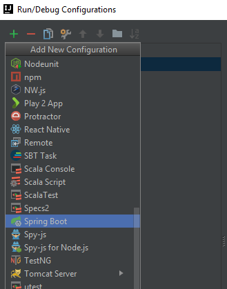

# VadBlogSpring
Java Spring Boot + Vue.js project

## How run it?

### Backend + Frontend:
* Export project
* Create Running for project 
	* Click "edit configuration" 
	* Click "+" and later "Spring Boot"
	* Set settings as on last picture 
* And RUN at localhost:8081 

  
	
  
  
  do it for ConfigServer too.


### DataBase
``` bash
# Write in terminal
.../MongoDB/bin/mongod
```
### Keycloak server
``` bash
# Download Keycloak server from official site. unzip it, then 
# Write in terminal
.../keycloak-3.4.3.Final/bin/standalone.bat -Djboss.socket.binding.port-offset=100
```
